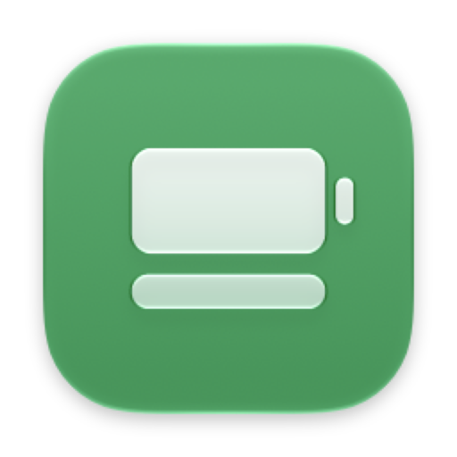
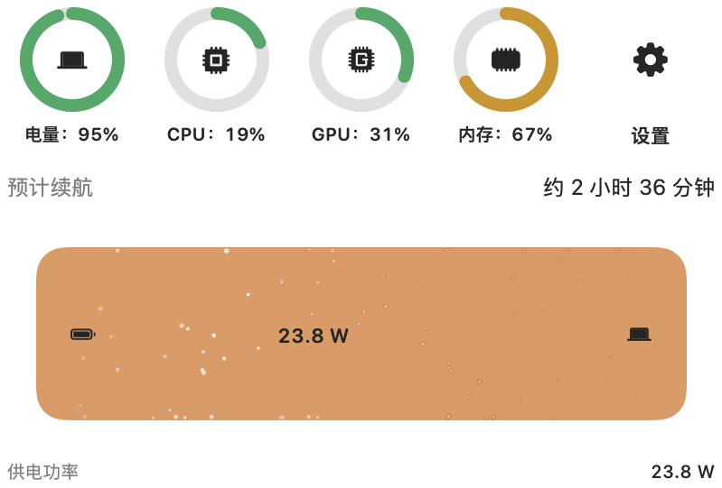
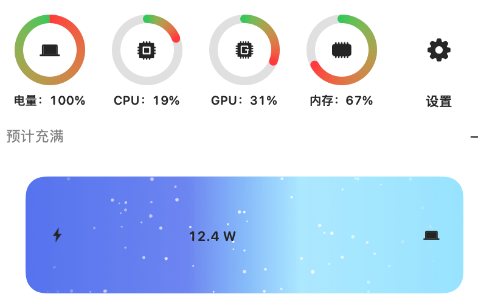
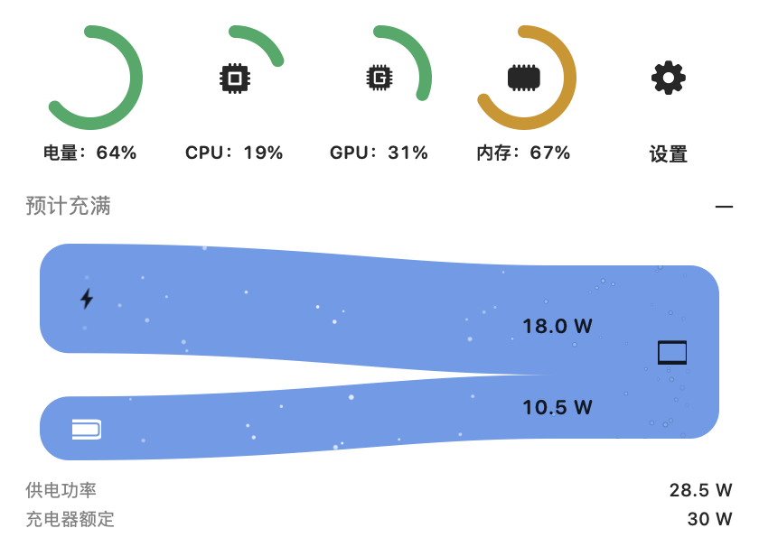
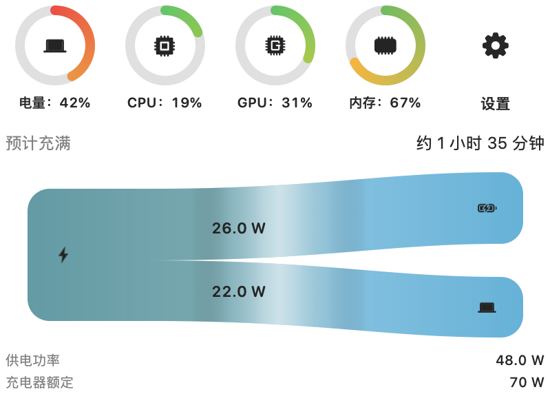

# MacPower

<p align="center">
  
</p>

[中文](README.md) | English

A native menu-bar battery monitor for MacBook. It stays out of the Dock, shows charge and charging state in the menu bar, and opens a Liquid Glass panel with live energy flow plus remaining runtime or time-to-full.

Unofficial. Not affiliated with Apple. Not a charge limiter.

## Energy flow

Four capsule shapes, one for each power path:

<table>
<tr>
<td align="center" width="50%">
<br>
<strong>Battery → Mac</strong>
</td>
<td align="center" width="50%">
<br>
<strong>Adapter → Mac</strong>
</td>
</tr>
<tr>
<td align="center" width="50%">
<br>
<strong>Adapter + battery → Mac</strong>
</td>
<td align="center" width="50%">
<br>
<strong>Adapter → battery + Mac</strong>
</td>
</tr>
</table>

## Features

- Menu bar only (`LSUIElement`): no Dock icon
- Six icon styles: fill / percent inside / percent beside, each with an outlined variant
- Optional charging mark (lightning bolt) on all styles
- Popover with live watts: charger, battery, and Mac, including a Y-split while charging
- Battery / CPU / GPU / memory rings, plus remaining runtime or time-to-full
- Energy-flow motion: white sheen, plus gradient / color / white filaments and particles (or off); particle / line rate 15–120 Hz
- Optional panel arrow; hides flush under the menu bar
- **On battery:** estimated remaining runtime  
  **Plugged in:** estimated time to full
- Colors follow energy state (green charging, orange discharging, blue holding / underpowered)
- Optional low-battery yellow / red tint at 20% and 10%
- Appearance palettes, light / dark, and 11 languages that switch live in Settings
- Open at login

## Install (GitHub Release)

1. Download `MacPower-1.2.4.dmg` from [Releases](https://github.com/RyanStarFox/MacPower/releases).
2. Open the disk image and drag **MacPower** into **Applications**.
3. Launch it from Applications. Look for the battery in the menu bar.

## If the app is damaged

The Release build is **ad-hoc signed, not Developer ID notarized**. Other people’s Macs will usually quarantine it after download. If macOS says the app is **damaged** or cannot be opened:

1. Press **Command (⌘) + Space**, search Spotlight for **Terminal**, and open it.
2. Copy the whole line below, paste it into Terminal, and press **Enter / Return**:

```bash
sudo xattr -rd com.apple.quarantine /Applications/MacPower.app
```

3. Terminal will ask for this Mac’s login password. **Nothing appears on screen as you type** — no dots, no asterisks. That is normal; it does not mean the password was not entered. Press Enter when you are done.

Then open MacPower from Applications.

A Developer ID + notarized build would skip this step. This project currently only has an Apple Development certificate, which cannot be used to distribute to other Macs (and often *causes* the “damaged” dialog if you ship it). Until a Developer ID is available, the unsigned/ad-hoc DMG plus the `xattr` command is the honest option.

## Requirements

- macOS 26 or later (developed on macOS 27)
- Apple Silicon MacBook with a battery

## Build from source

```bash
brew install xcodegen
xcodegen generate
xcodebuild -project MacPower.xcodeproj -scheme MacPower -configuration Release -destination 'platform=macOS' build
```

To rebuild the GitHub Release disk image:

```bash
./scripts/make_dmg.sh
```

The `.dmg` lands in `dist/`.

## License

MIT. See [LICENSE](LICENSE).
