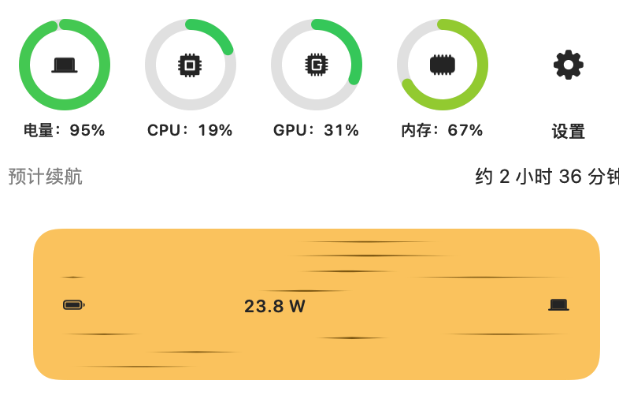
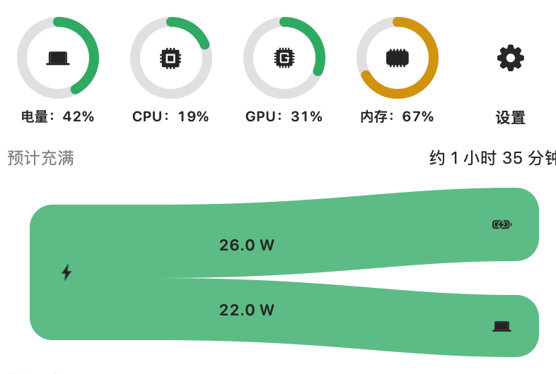

# MacPower

<p align="center">
  
</p>

[中文](README.md) | English

A menu-bar battery monitor for MacBook. It stays out of the Dock and opens a **Liquid Glass** panel with live energy flow, status rings, and remaining runtime or time-to-full — highly customizable.

## Preview

<table>
  <tr>
    <td align="center" width="33%"><br><b>Battery → Mac</b> · particles</td>
    <td align="center" width="33%"><br><b>Adapter → Mac</b> · gradient</td>
    <td align="center" width="33%"><br><b>Adapter + battery → Mac</b> · filaments · high contrast</td>
  </tr>
  <tr>
    <td align="center"><br><b>Adapter → battery + Mac</b> · slide</td>
    <td align="center"><br><b>Battery → Mac</b> · smooth · filaments</td>
    <td align="center"><br><b>Adapter → battery + Mac</b> · no motion</td>
  </tr>
</table>

## Features

- Liquid Glass menu-bar monitor: energy flow, battery / CPU / GPU / memory rings, remaining runtime or time-to-full
- Highly customizable: color presets, icon packs, motion styles, menu-bar battery look, and more
- No Dock icon; optional open-at-login and automatic update checks
- Languages: Simplified Chinese, Traditional Chinese, English, Japanese, Korean, French, German, Spanish, Brazilian Portuguese, Italian, Russian (follow system or pick one in Settings)

## Install

1. Download the latest `MacPower-*.dmg` from [Releases](https://github.com/RyanStarFox/MacPower/releases), open it, and drag **MacPower** into **Applications**.
2. **Fix “damaged” app** (Release builds are ad-hoc signed and not notarized, so Gatekeeper often quarantines them):

```bash
sudo xattr -rd com.apple.quarantine /Applications/MacPower.app
```

Paste that into Terminal and press Enter. Nothing appears while you type the password — that is normal.
3. Open **System Settings → Menu Bar**, make sure **MacPower** is allowed to appear in the menu bar, then launch it from Applications.

## Requirements

- macOS 14 or later (Liquid Glass on macOS 26+; material fallback on 14/15)
- Apple Silicon MacBook with a battery

## Build from source

```bash
brew install xcodegen
xcodegen generate
xcodebuild -project MacPower.xcodeproj -scheme MacPower -configuration Release -destination 'platform=macOS' build
```

Rebuild the Release disk image:

```bash
./scripts/make_dmg.sh
```

The `.dmg` lands in `dist/`.

## License

This project is licensed under the MIT License with the Commons Clause. You may use, modify, and distribute it free of charge, but you may not sell the software or monetize a product or service whose value derives substantially from its functionality. See [LICENSE](LICENSE).
